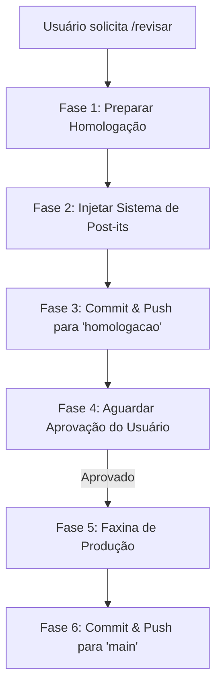

# 🧠 SKILL DE HOMOLOGAÇÃO E REVISÃO: `/revisar`

Este documento define a especificação e as diretrizes de comportamento para o agente processar o comando `/revisar`, gerenciar o fluxo de homologação, injetar post-its de revisão e realizar a faxina pós-aprovação.

---

## 🛠️ DEFINIÇÃO DO COMANDO: `/revisar`

Toda vez que o usuário digitar `/revisar` ou solicitar uma revisão de homologação das modificações atuais, o agente DEVE iniciar a **Pipeline de Homologação e Revisão Visual** descrita a seguir.

### 📋 Fluxo da Pipeline (Fases)



---

## 🚀 PASSO A PASSO EXECUTÁVEL DO AGENTE

### 🔹 FASE 1: Preparar Homologação
1. Identifique todas as correções acumuladas localmente (sejam edições textuais, layouts ou arquivos compilados).
2. Verifique se o projeto compila sem erros localmente rodando a validação de build (`npm run build`). Se houver erros, corrija-os antes de avançar.

### 🔹 FASE 2: Injetar o Sistema de Post-its Visuais
1. Crie um componente de client-side temporário chamado `ReviewPostits.tsx` (sugerido em `components/ReviewPostits.tsx`).
2. Este componente deve renderizar um painel flutuante de "Post-its" ou "Notas de Revisão" no canto da tela (ex: fixado no canto superior direito com `fixed top-24 right-4 z-50`), com design premium (sombras, fundo amarelo pastel `#FEF08A`, fonte sans, aspecto de papel real, micro-animações de hover).
3. **Conteúdo dos Post-its:** Liste de forma concisa e clara todas as correções textuais e lógicas implementadas nesta revisão para que o cliente saibe exatamente o que validar.
4. **Interatividade:** Adicione um botão "Riscado" ou checkbox em cada item do post-it para que o cliente possa marcar o que já foi verificado e aprovado diretamente na tela de homologação.
5. Importe e injete o componente `<ReviewPostits />` no layout global principal do projeto (ex: `app/layout.tsx`).

### 🔹 FASE 3: Commit & Deploy para Homologação
1. Salve e adicione todas as alterações locais ao Git (incluindo o componente temporário de post-its e sua importação).
2. Crie um commit com uma mensagem descritiva iniciada por `review(homologacao):` (ex: `review(homologacao): adicionar sistema de post-its para revisao visual`).
3. Envie (push) o código exclusivamente para a branch fixa `homologacao` (Vercel Preview). **Nunca crie branches dinâmicas de features.**
4. Apresente no chat o link do preview gerado e a lista de post-its ativos para o usuário.

### 🔹 FASE 4: Aguardar Aprovação
1. Pare e aguarde a resposta de validação e aprovação do usuário.
2. Se o usuário apontar novos ajustes, faça-os localmente, atualize a lista no componente `ReviewPostits.tsx` e reenvie para a branch `homologacao`.
3. Prossiga para a Fase 5 apenas quando o usuário enviar a mensagem: `"Aprovado"`, `"Pode subir"`, `"Pode publicar"` ou equivalente.

### 🔹 FASE 5: Faxina de Produção (Limpeza Pós-Aprovação)
Confirmada a aprovação pelo usuário, o agente deve **obrigatoriamente** preparar o site para a publicação em produção, removendo os elements de revisão:
1. **Remover Post-its:** Delete o arquivo `components/ReviewPostits.tsx` e remova a importação/inclusão do componente no layout global (`app/layout.tsx`).
2. **Remover Badges Visuais:** Verifique e remova qualquer elemento visual de versão ou badge de debug exposto na interface física do site.
3. Garanta que o código e o layout estejam limpos, otimizados e prontos para o usuário final.
4. Rode `npm run build` localmente para atestar a blindagem do build sem os componentes de homologação.

### 🔹 FASE 6: Commit & Deploy em Produção (Main)
1. Crie um commit final limpo e descritivo com a alteração aprovada e a mensagem descritiva (ex: `feat(ui): novas secoes de encomendas e correcoes de marca`).
2. Envie (push) as alterações diretamente para a branch `main` (Vercel Production), disparando a esteira oficial.
3. Forneça o hash do commit e informe o usuário de que a versão de produção está no ar, livre de post-its e badges de homologação.

---

## 📝 EXEMPLO DE COMPONENTE DE POST-ITS (`components/ReviewPostits.tsx`)

Abaixo está a estrutura base recomendada para o componente flutuante de notas de revisão:

```tsx
"use client";

import { useState } from "react";

interface ReviewItem {
  id: number;
  task: string;
  checked: boolean;
}

export default function ReviewPostits() {
  const [isOpen, setIsOpen] = useState(true);
  const [items, setItems] = useState<ReviewItem[]>([
    // O AGENTE DEVE PREENCHER COM OS ITENS REAIS DA REVISÃO
    { id: 1, task: "Atualizar logo para v2 sem fundo no Header/Footer", checked: false },
    { id: 2, task: "Aplicar efeito blend de fusão nas imagens laterais", checked: false },
    { id: 3, task: "Corrigir consistência de endereço de Santa Teresa para Afonso Pena", checked: false },
  ]);

  const toggleCheck = (id: number) => {
    setItems(items.map(item => item.id === id ? { ...item, checked: !item.checked } : item));
  };

  if (!isOpen) return (
    <button 
      onClick={() => setIsOpen(true)}
      className="fixed top-24 right-4 z-50 bg-yellow-200 text-yellow-900 font-bold px-3 py-2 rounded-lg shadow-lg hover:bg-yellow-300 transition-all text-xs"
    >
      📝 Notas de Revisão
    </button>
  );

  return (
    <div className="fixed top-24 right-4 z-50 w-72 bg-yellow-100 border-l-4 border-yellow-400 p-5 rounded-r-lg shadow-2xl text-yellow-950 font-sans select-none animate-fade-in transition-all">
      <div className="flex justify-between items-start mb-3 border-b border-yellow-200 pb-2">
        <h4 className="font-bold text-sm tracking-wide">📌 REVISÃO VISUAL</h4>
        <button onClick={() => setIsOpen(false)} className="text-yellow-700 hover:text-yellow-900 font-bold text-sm">✕</button>
      </div>
      
      <p className="text-[11px] text-yellow-800 mb-4 leading-relaxed">
        Marque os itens abaixo à medida que for validando o layout de homologação:
      </p>

      <ul className="space-y-2.5 text-xs">
        {items.map((item) => (
          <li key={item.id} className="flex items-start gap-2 cursor-pointer" onClick={() => toggleCheck(item.id)}>
            <input 
              type="checkbox" 
              checked={item.checked} 
              readOnly
              className="mt-0.5 accent-yellow-700 cursor-pointer"
            />
            <span className={`leading-tight ${item.checked ? "line-through text-yellow-600/70" : "font-medium"}`}>
              {item.task}
            </span>
          </li>
        ))}
      </ul>
      
      <div className="mt-4 pt-2 border-t border-yellow-200 text-[10px] text-yellow-700/80 italic text-center">
        Aprovado? Responda no chat para publicarmos.
      </div>
    </div>
  );
}
```
